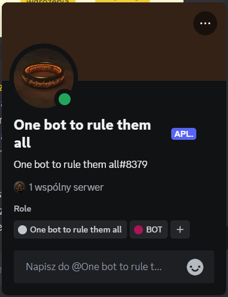

# discord-record-bot

## Description
A basic bot that sends a welcome message, with potential for more features in the future.

It is working on discord server [Order of Devs Community](https://discord.gg/bqvfTcFMYu).

## Commands
 - "npm start" - runs the application
 - "npm run dev" - runs the application in watch mode
 - "docker build -t discord-bot ." - build the Docket image

## Prerequisites
- Node.js
- Docker - optional if you want run it inside container

## Quick Start Guide
### Using Docker
1. Clone repository:

Command for SSH
```bash
git clone git@github.com:UgzSourceCode/discord-user-bot.git
```
Command for HTTPS
```bash
git clone https://github.com/UgzSourceCode/discord-user-bot.git
```

2. Build the Docker image:

Navigate to the cloned repository folder and run:
```bash
docker build -t discord-bot .
```

3. Configure the bot:

There is an example configuration in the `.env-sample` file. Please create a `.env` file and populate it with your own values.

4. Run the bot:

```bash
docker run --env-file .env discord-bot
```

### Without docker
1. Clone repository:

Command for SSH
```bash
git clone git@github.com:UgzSourceCode/discord-user-bot.git
```
Command for HTTPS
```bash
git clone https://github.com/UgzSourceCode/discord-user-bot.git
```

2. Install dependency:

Navigate to the cloned repository folder and run:
```bash
npm install --production
```

3. Configure the bot:

There is an example configuration in the `.env-sample` file. Please create a `.env` file and populate it with your own values.

4. Run the bot:

```bash
npm start
```

## Dependencies
 - `discord.js`
 - `dotenv`
 - `ts-node`
 - `modclean`
 - `pino`
 - `pino-pretty`
 - `pino-tee`

## Development Dependencies:
 - `@types/node`
 - `ts-node-dev`
 - `typescript`

## Links:
 - [Issues](https://github.com/UgzSourceCode/discord-user-bot/issues)